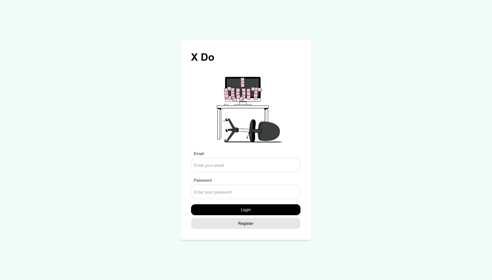
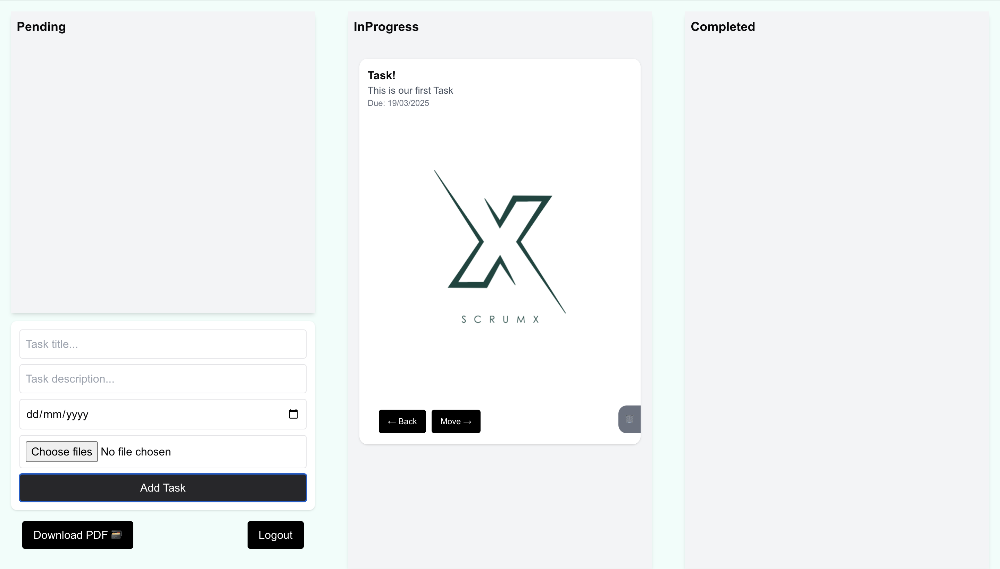
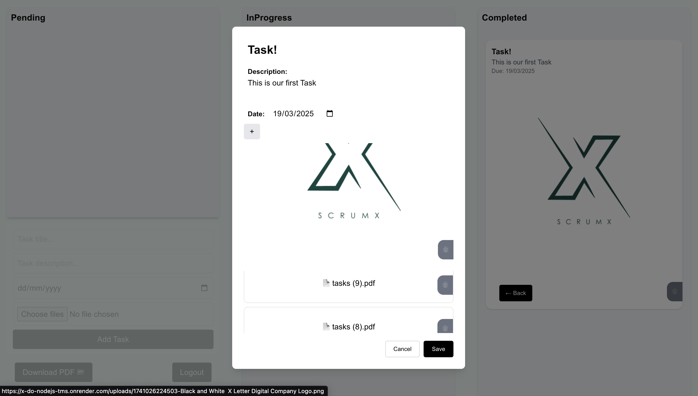
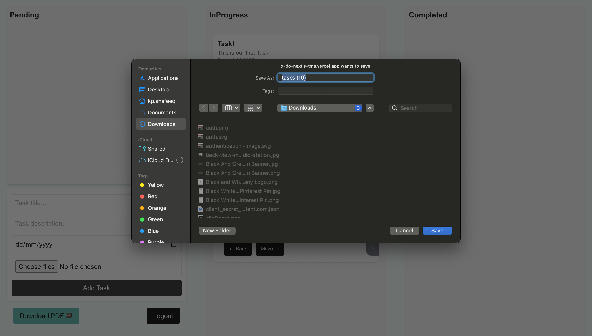
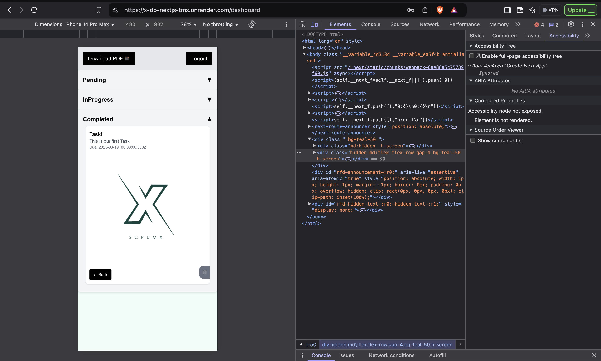
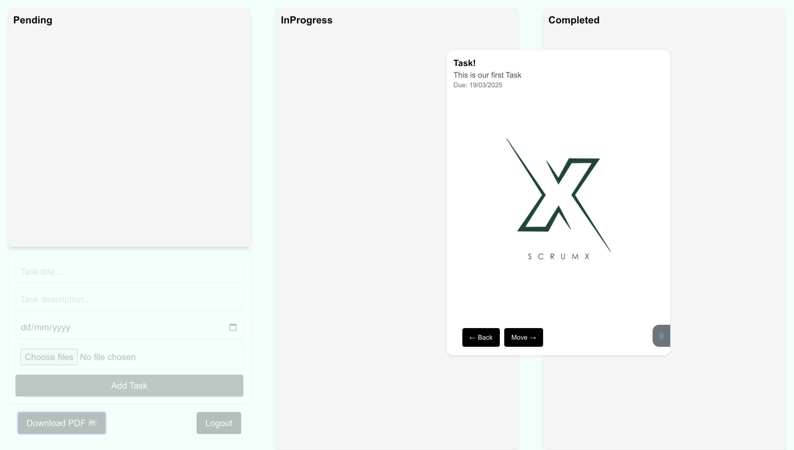

# Xdo - Task Management System with PDF Export

## Overview
Xdo is a task management system built using **Next.js, Node.js, and MongoDB**, designed to help users efficiently create, manage, and export tasks as PDF files.

## Features
### Frontend (Next.js + Context API)
- User authentication (register & login)

- Dashboard to view all tasks  
- CRUD operations for tasks (create, update, delete)  
- Task attributes: **Title, Description, Due Date, Status (Pending, In Progress, Completed)**  

- **PDF export** functionality for tasks

 

- **Mobile-responsive** design  

- **Drag-and-drop** task management (Desktop view) 

 

- Styled with **Tailwind CSS**  

### Backend (Node.js API + MongoDB)
- **User Authentication**  
  - Register and login using **JWT authentication**  
  - Secure password storage using **bcrypt**  
- **Task Management API**  
  - CRUD operations for tasks  
  - User-specific task access with protected routes  
- **PDF Generation API**  
  - Export tasks as a PDF file  
- **Real-time Updates** using **WebSockets**  
- **File Upload Support** for tasks  

## Technologies Used
### Frontend
- **Next.js** (15.1.7)
- **React** (19.0.0)
- **Context API** for state management
- **Tailwind CSS** for styling
- **Framer Motion** for animations
- **Dnd Kit & Hello Pangea DnD** for drag-and-drop functionality
- **Formik + Yup** for form handling and validation
- **Axios** for API requests

### Backend
- **Node.js + Express**
- **MongoDB + Mongoose**
- **JWT Authentication**
- **Bcrypt.js** for secure password storage
- **Multer** for file uploads
- **PDFKit** for PDF generation
- **WebSockets (ws)** for real-time updates

## Deployment
### Frontend
- **Render:** [Xdo on Render](https://x-do-nextjs-tms.onrender.com)
- **Vercel:** [Xdo on Vercel](https://x-do-nextjs-tms.vercel.app/login)

### Backend
- **Render:** [Xdo API](https://x-do-nodejs-tms.onrender.com)

### Free Tier Hosting Notice
- The backend is hosted on Render's **free tier**, which enters **sleep mode** after **15 minutes of inactivity**.
- When inactive, the initial response time may be slower due to waking up from sleep mode.

## License
This project is open-source and available for contributions. Feel free to fork and improve it!

---
Made by [Mohamed Shafeeq](https://github.com/shafeeq777444)

